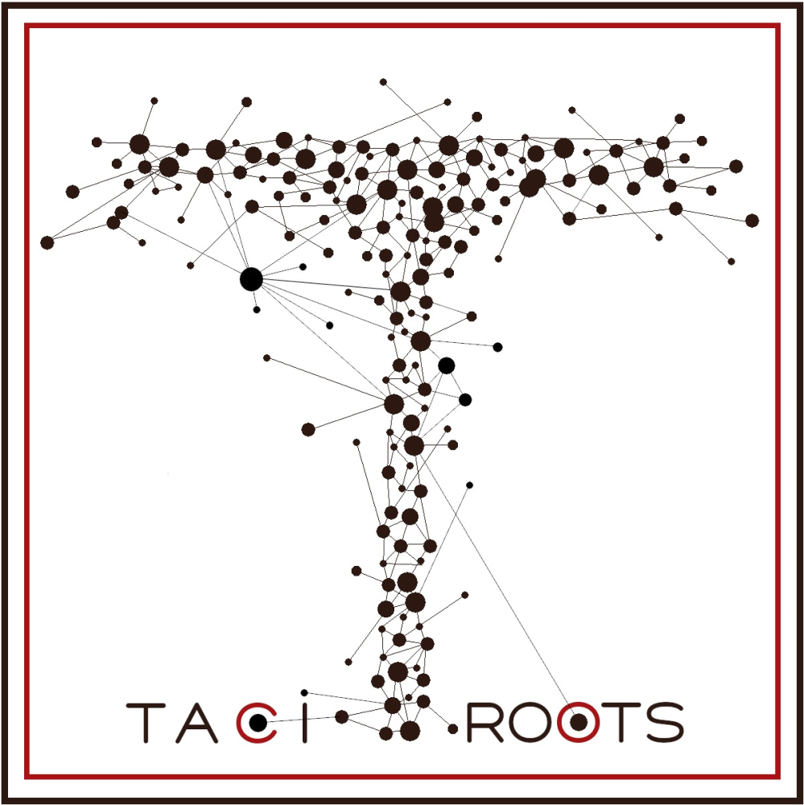

# ci-meta-Deploy

<div id="top"></div>

[![Contributors][contributors-shield]][contributors-url]
[![Forks][forks-shield]][forks-url]
[![Stargazers][stars-shield]][stars-url]
[![Issues][issues-shield]][issues-url]
[![MIT License][license-shield]][license-url]
[![LinkedIn][linkedin-shield]][linkedin-url]

<!-- PROJECT LOGO -->
<br />
<div align="center">
  <a href="https://github.com/tizianoBranduardi/ci-meta-Deploy">
    
  </a>

<h3 align="center">Ci-meta</h3>

  <p align="center">
    Async web application for historical document analysis
    <br />
    <a href="https://github.com/tizianoBranduardi/ci-meta-Deploy/issues">Report Bug</a>
    ·
    <a href="https://github.com/tizianoBranduardi/ci-meta-Deploy/issues">Request Feature</a>
  </p>
</div>

<!-- ABOUT THE PROJECT -->
## About The Project

<p align="right">(<a href="#top">back to top</a>)</p>


### Built With
* [Vue.js](https://vuejs.org/)
* [Flask](https://flask.palletsprojects.com/)

<p align="right">(<a href="#top">back to top</a>)</p>

### Installation

1. Proceed to configure uwsgi and nginx (or the preferred web server)
2. Clone the repo
   ```sh
   git clone https://github.com/tizianoBranduardi/ci-meta-Deploy/
   ```
3. Install NPM packages
   ```sh
   npm install
   ```
4. Go to the front-end root
   ```sh
   cd Front-end/ci-meta/
   ```
5. Build the front-end 
   ```sh
   npm run build
   ```

<p align="right">(<a href="#top">back to top</a>)</p>


<!-- USAGE EXAMPLES -->
## Usage

The application requires uwsgi for the back-end side and a web server (e.g. nginx) for the front-end one. 

<p align="right">(<a href="#top">back to top</a>)</p>

<!-- CONTRIBUTING -->
## Contributing

Contributions are what make the open source community such an amazing place to learn, inspire, and create. Any contributions you make are **greatly appreciated**.

If you have a suggestion that would make this better, please fork the repo and create a pull request. You can also simply open an issue with the tag "enhancement".
Don't forget to give the project a star! Thanks again!

1. Fork the Project
2. Create your Feature Branch (`git checkout -b feature/AmazingFeature`)
3. Commit your Changes (`git commit -m 'Add some AmazingFeature'`)
4. Push to the Branch (`git push origin feature/AmazingFeature`)
5. Open a Pull Request

<p align="right">(<a href="#top">back to top</a>)</p>

<!-- CONTACT -->
## Contact

Tiziano Branduardi -  tiziano.branduardi@gmail.com

Tacitroots project : https://sites.unimi.it/tacitroots/

<p align="right">(<a href="#top">back to top</a>)</p>


<!-- MARKDOWN LINKS & IMAGES -->
<!-- https://www.markdownguide.org/basic-syntax/#reference-style-links -->
[contributors-shield]: https://img.shields.io/github/contributors/tizianoBranduardi/ci-meta-Deploy.svg?style=for-the-badge
[contributors-url]: https://github.com/tizianoBranduardi/ci-meta-Deploy/graphs/contributors
[forks-shield]: https://img.shields.io/github/forks/tizianoBranduardi/ci-meta-Deploy.svg?style=for-the-badge
[forks-url]: https://github.com/tizianoBranduardi/ci-meta-Deploy/network/members
[stars-shield]: https://img.shields.io/github/stars/tizianoBranduardi/ci-meta-Deploy.svg?style=for-the-badge
[stars-url]: https://github.com/tizianoBranduardi/ci-meta-Deploy/stargazers
[issues-shield]: https://img.shields.io/github/issues/tizianoBranduardi/ci-meta-Deploy.svg?style=for-the-badge
[issues-url]: https://github.com/tizianoBranduardi/ci-meta-Deploy/issues
[license-shield]: https://img.shields.io/github/license/tizianoBranduardi/ci-meta-Deploy.svg?style=for-the-badge
[license-url]: https://github.com/tizianoBranduardi/ci-meta-Deploy/blob/master/LICENSE.txt
[linkedin-shield]: https://img.shields.io/badge/-LinkedIn-black.svg?style=for-the-badge&logo=linkedin&colorB=555
[linkedin-url]: https://www.linkedin.com/in/tiziano-branduardi-116166112/
[product-screenshot]: images/screenshot.png
